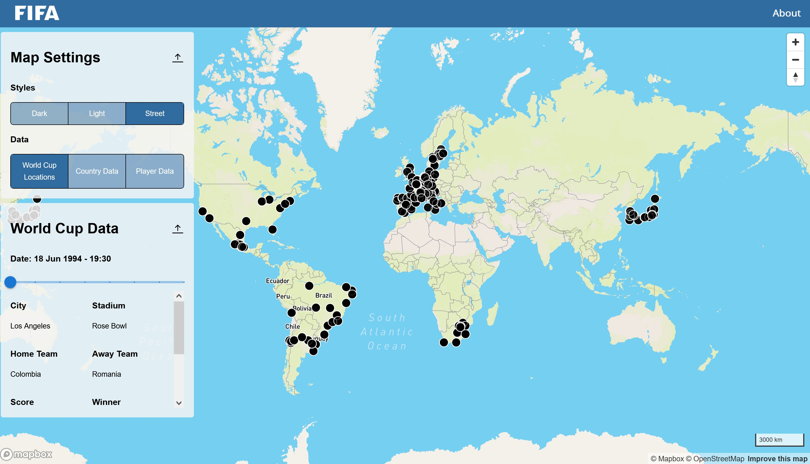

# Mapping FIFA World Cup Data

[Link to Deployed Site](https://geog-458-final-project.pages.dev/)

## Team Members
- Hudson Potts 
- Ethan Michael Hubbart
- Aaron Thai
- Yuantai Li
- Chalsea Chen

### Project Description
The project was designed to observe the success of different countries in the FIFA World Cup in terms of where matches were hosted, number of wins, and number of players. This project visualizes World Cup data over time with maps that focus on matches, teams, and countries where players originate from. 
  
### Project Goal
The project hopes to provide insight into World Cup success or failure for different nations, while also providing a way to view player success and the history of the tournament. While the project could potentially bring up player’s personal data all of that data will have already been public. It could make certain countries look poorly due to the results they’ve had in the World Cup, but judging performances and competition is in the nature of the sport. We will visualize World Cup success in multiple ways so it is possible to see if some countries are more successful in different ways.

### Screenshots

The projection of our maps is Mercator and located at the center of [0,16] with zoom level 1. Our main map has 3 base maps that the user can view, by clicking on the Styles buttons users can switch the base map to dark, light, and street base maps provided by Mapbox. 

There are 3 interactive maps that users can switch to check. For the World Cup Locations map, the user can click on each match to check the information including the date, location, result, and attendance of the match. For the country map, the user can click on the country that participated World Cup and check the information about the achievements. 

### Data sources
 FIFA map data was obtained from Kaggle. 

Data for match locations and countries / teams was orginally collected by Kaggle user Andre Becklas, who took it from the FIFA World Cup Archive website. See the data [here](https://www.kaggle.com/datasets/abecklas/fifa-world-cup?resource=download&select=WorldCups.csv). 

Data for players was originally collected by Kaggle user Stefano Leone, who extracted it from the video game FIFA 22. See the data [here](https://www.kaggle.com/datasets/stefanoleone992/fifa-22-complete-player-dataset?select=players_22.csv ).

Country boundary shapefile for the choropleth map of number of players was obtained from: [world](https://datahub.io/core/geo-countries) and 
[uk](https://geoportal.statistics.gov.uk/datasets/ons::countries-december-2021-uk-bgc/explore?location=52.905565%2C-1.566814%2C6.12&showTable=true).

To see the processed data files we used, please visit the project GitHub [here](https://github.com/ehubbartt/geog-458-final-project/tree/master/src/asset).

### Acknowledgement

Great thanks to Professor Zhao and TA Jiaxin Feng of GEOG458 for the lecture, labs, and comments.
Course GitHub for Professor Zhao's GEOG458 class is [here](https://github.com/jakobzhao/geog458).

### Applied libraries
We used React Mapbox GL JS as the framework for this project. We used mapshaper.org to compress geojson files. Our data and project files are hosted on Github. Basemaps are provided by Mapbox.

# Getting Started with Create React App (React Documentation)

This project was bootstrapped with [Create React App](https://github.com/facebook/create-react-app).

## Available Scripts

In the project directory, you can run:

### `npm start`

Runs the app in the development mode.\
Open [http://localhost:3000](http://localhost:3000) to view it in your browser.

The page will reload when you make changes.\
You may also see any lint errors in the console.

### `npm test`

Launches the test runner in the interactive watch mode.\
See the section about [running tests](https://facebook.github.io/create-react-app/docs/running-tests) for more information.

### `npm run build`

Builds the app for production to the `build` folder.\
It correctly bundles React in production mode and optimizes the build for the best performance.

The build is minified and the filenames include the hashes.\
Your app is ready to be deployed!

See the section about [deployment](https://facebook.github.io/create-react-app/docs/deployment) for more information.

### `npm run eject`

**Note: this is a one-way operation. Once you `eject`, you can't go back!**

If you aren't satisfied with the build tool and configuration choices, you can `eject` at any time. This command will remove the single build dependency from your project.

Instead, it will copy all the configuration files and the transitive dependencies (webpack, Babel, ESLint, etc) right into your project so you have full control over them. All of the commands except `eject` will still work, but they will point to the copied scripts so you can tweak them. At this point you're on your own.

You don't have to ever use `eject`. The curated feature set is suitable for small and middle deployments, and you shouldn't feel obligated to use this feature. However we understand that this tool wouldn't be useful if you couldn't customize it when you are ready for it.

## Learn More

You can learn more in the [Create React App documentation](https://facebook.github.io/create-react-app/docs/getting-started).

To learn React, check out the [React documentation](https://reactjs.org/).

### Code Splitting

This section has moved here: [https://facebook.github.io/create-react-app/docs/code-splitting](https://facebook.github.io/create-react-app/docs/code-splitting)

### Analyzing the Bundle Size

This section has moved here: [https://facebook.github.io/create-react-app/docs/analyzing-the-bundle-size](https://facebook.github.io/create-react-app/docs/analyzing-the-bundle-size)

### Making a Progressive Web App

This section has moved here: [https://facebook.github.io/create-react-app/docs/making-a-progressive-web-app](https://facebook.github.io/create-react-app/docs/making-a-progressive-web-app)

### Advanced Configuration

This section has moved here: [https://facebook.github.io/create-react-app/docs/advanced-configuration](https://facebook.github.io/create-react-app/docs/advanced-configuration)

### Deployment

This section has moved here: [https://facebook.github.io/create-react-app/docs/deployment](https://facebook.github.io/create-react-app/docs/deployment)

### `npm run build` fails to minify

This section has moved here: [https://facebook.github.io/create-react-app/docs/troubleshooting#npm-run-build-fails-to-minify](https://facebook.github.io/create-react-app/docs/troubleshooting#npm-run-build-fails-to-minify)
